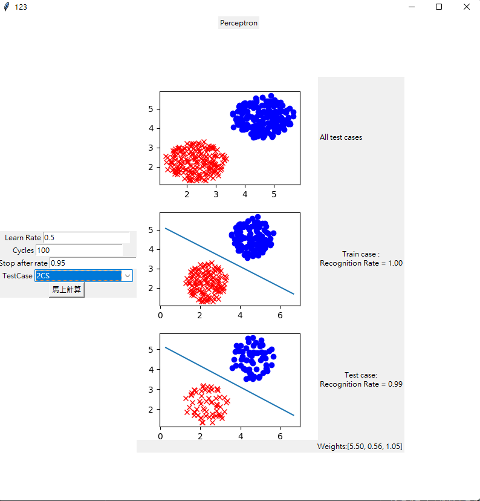

# Perceptron

### Usage
-------
run HW1.exe

Specify the parameters from the left side and choose which file to test.

The perceptron is trained using two-third of the data, and will use a line to seperate two groups.

The result image are as follows:
- All testcases
- Result of the perceptron and use train data as reference
- Result of the perceptron and use test data as reference

### Screenshot
-------

